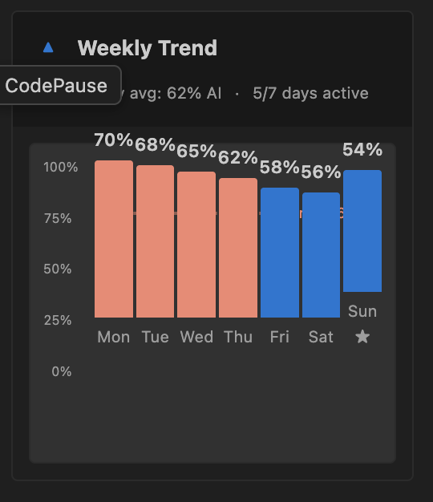

<div align="center">
  
  <h1>CodePause</h1>
  <p><strong>Pause. Review. Own your code.</strong></p>

  <p>
    <a href="https://marketplace.visualstudio.com/items?itemName=codepause.code-pause"></a>
    <a href="LICENSE.md"></a>
    <a href="https://code.visualstudio.com/"></a>
  </p>
</div>

---

## The Problem

Using AI coding assistants like Copilot, Cursor, or Claude Code? You might be:

- **Shipping more bugs**: AI-generated code has **1.7x more defects** than human-written code (CodeRabbit 2025)
- **Overestimating accuracy**: Developers overestimate AI effectiveness by **~20%** (METR Study)
- **Slowing down**: Junior developers take **7-10% longer** with AI assistance (McKinsey)
- **Losing skills**: Blind approval of AI suggestions leads to "**cognitive debt**" and skill degradation

## The Solution

**CodePause tracks your AI usage in real-time** and provides skill-level aware guidance to help you:

- **Maintain code ownership** - Know when you're over-relying on AI
- **Catch bugs earlier** - Thoughtful review prevents blind approval
- **Preserve critical thinking** - Balance AI assistance with hands-on coding
- **Build better habits** - Gentle nudges, not intrusive warnings

## How It Works

CodePause runs silently in the background, tracking three key metrics:

1. **AI vs Manual Balance** - Percentage of code generated by AI vs written by you
2. **Review Quality Score** - How thoroughly you review AI suggestions (0-100)
3. **Balance Score** - Overall health combining AI usage, review quality, and patterns

You get respectful, skill-level aware guidance when patterns emerge—not annoying popups.

<div align="center">
  
  <p><em>Clean dashboard showing your three core metrics at a glance</em></p>
</div>

---

## Features

### Three Core Metrics

CodePause focuses on what matters:

**1. AI vs Manual Balance**
- Track percentage of AI-generated vs manually-written code
- Skill-level targets: Junior <60%, Mid <50%, Senior <40%
- Trend analysis over 7-30-90 days

<div align="center">
  
  <p><em>Track your progress with 7-day AI usage trends</em></p>
</div>

**2. Review Quality Score (0-100)**
- Measures how thoroughly you review AI code
- Based on: time in focus (40%), scrolling (20%), cursor movement (20%), edits (20%)
- Categories: Thorough (70+), Light (40-69), Minimal (<40)

**3. Balance Score**
- Overall health indicator
- Combines AI/manual balance + review quality + patterns
- Ratings: Excellent, Good, Needs Attention

### Skill-Level Aware Notifications

Different guidance for different experience levels:

**Junior Developers:**
- Educational tone with learning opportunities
- "Building foundational skills requires hands-on practice..."
- More frequent guidance (hourly)

**Mid-Level Developers:**
- Balanced, professional tone
- Data-driven recommendations
- Moderate frequency

**Senior Developers:**
- Evidence-based, research-cited
- Pattern analysis and insights
- Least intrusive (daily)

### Respectful Alert System

- **Snooze for 24 hours** - Take a break from notifications
- **Dismiss permanently** - Customize what you see
- **Adaptive frequency** - Low/medium/high settings
- **Never intrusive** - No popups during active typing

### Unified AI Detection

Detects AI code from ANY tool with 99.99% accuracy:

- **Method 1:** VS Code Inline Completion API (Copilot, Cursor)
- **Method 2:** Large paste detection (>100 characters)
- **Method 3:** External file changes (agent mode)
- **Method 4:** Git commit markers (Claude Code, etc.)
- **Method 5:** Change velocity analysis (typing speed)

No tool-specific configuration needed!

### Multi-Language Support

CodePause supports **15 programming languages** with intelligent complexity-aware review time calculations:

**Highest Complexity** (requires most careful review):
- **Rust** (2.0x) - Memory safety, borrow checker
- **C++** (1.8x) - Manual memory management, 70% of CVEs
- **C** (1.7x) - Buffer overflows, pointer arithmetic
- **Scala** (1.7x) - Advanced FP, steep learning curve

**High Complexity**:
- **Java** (1.6x) - Verbose, established patterns
- **TypeScript** (1.5x) - Structural typing, 15-19% bug detection
- **JavaScript** (1.5x) - Dynamic typing, inconsistent patterns
- **C#** (1.5x) - .NET complexity, unified type system

**Moderate to High**:
- **Swift** (1.4x), **Kotlin** (1.4x), **Python** (1.4x), **Go** (1.4x)

**Moderate**:
- **Ruby** (1.3x), **PHP** (1.2x)

**What do these multipliers mean?**
- A 2.0x multiplier means Rust code needs **twice** the review time compared to baseline
- Multipliers are based on empirical research: memory safety, bug density, learning curves, and cyclomatic complexity
- CodePause automatically adjusts expected review times based on the language you're working in

**See full research and methodology**: [LANGUAGE_COMPLEXITY.md](./LANGUAGE_COMPLEXITY.md)

### Clean, Simple Dashboard

No clutter. Just insights.

- 3 metric cards (AI%, Manual%, Balance)
- 7-day trend visualization
- Current session stats
- Quick actions (view details, adjust targets, snooze)

**Removed:** Gamification, XP levels, achievements, tool breakdowns

<div align="center">
  
  <p><em>Seamlessly integrated into your VS Code workflow</em></p>
</div>

<div align="center">
  
  <p><em>Understand how you interact with AI - Agent Mode, Inline Autocomplete, and Chat/Paste</em></p>
</div>

---

## Installation

### From VS Code Marketplace

1. Open VS Code
2. Press `Ctrl+Shift+X` (Windows/Linux) or `Cmd+Shift+X` (Mac)
3. Search for "CodePause"
4. Click **Install**

### From Source (Development)

```bash
# Clone repository
git clone https://github.com/codepause-dev/codepause-extension.git
cd vscode-extension

# Install dependencies
npm install

# Compile TypeScript
npm run compile

# Run tests
npm test

# Launch Extension Development Host
# Press F5 in VS Code
```

---

## Quick Start

### 1. Set Your Experience Level

First time? CodePause will ask:

```
Welcome to CodePause!

What's your experience level?
[I'm Junior] [I'm Mid-Level] [I'm Senior]
```

This adjusts notification frequency and thresholds.

### 2. View Dashboard

Press `Ctrl+Shift+P` → "CodePause: Open Dashboard"

Or click the CodePause icon in the activity bar.

### 3. Start Coding

CodePause runs silently in the background, tracking:
- AI vs manual code balance
- Review quality for AI suggestions
- Patterns and trends

### 4. Get Thoughtful Guidance

When needed, CodePause provides:
- Gentle reminders to review code
- Balance alerts if over-relying on AI
- Positive reinforcement when doing well

---

## Configuration

CodePause can be customized to fit your workflow. See [Configuration Guide](docs/CONFIGURATION.md) for:
- All available settings
- Experience level thresholds
- Command reference

Quick access: `Ctrl+,` → Search for "CodePause"

---

## FAQ

Have questions? Check our [FAQ](docs/FAQ.md) for answers to common questions about:
- Performance impact
- Data privacy
- Compatibility
- Customization
- Export options
- Open source licensing

---

## Understanding Your Metrics

CodePause tracks three core metrics to help you maintain coding skills while using AI effectively:

### Core Metrics

- **[AI Percentage](./docs/metrics/ai-percentage.md)** - Your AI-to-manual code balance (Target: <50% for mid-level)
- **[Code Ownership Score](./docs/metrics/code-ownership-score.md)** - How thoroughly you review AI code (Target: 70+ for thorough review)
- **[Skill Development Health](./docs/metrics/skill-development-health.md)** - Overall development health indicator (Excellent / Good / Needs Attention)

### Additional Metrics

For detailed information on all metrics, see:
- [Review Quality Metrics](./docs/metrics/review-quality.md)
- [AI Usage Patterns](./docs/metrics/agent-mode.md) (Agent Mode, Inline Autocomplete, Chat/Paste)
- [Consistency Metrics](./docs/metrics/streak-days.md) (Streak Days, Unreviewed Files)

View the complete metrics documentation in the [docs/metrics](./docs/metrics/) directory.

---

## How It Works

### AI Detection (99.99% Accuracy)

CodePause uses 5 detection methods:

1. **Inline Completion API** (High confidence)
   - Official VS Code API
   - Detects Copilot, Cursor inline suggestions

2. **Large Paste Detection** (High confidence)
   - Single change >100 characters
   - Analyzes code structure (braces, keywords)

3. **External File Changes** (High confidence)
   - File modified while not open
   - Indicates agent/autonomous mode

4. **Git Commit Markers** (Absolute confidence)
   - Detects "Co-Authored-By: Claude", "@claude-code"
   - Explicit AI markers

5. **Change Velocity** (Medium confidence)
   - >500 characters in <1 second
   - Pattern-based heuristic

**Priority System:** If conflict, highest confidence method wins.

### Review Quality Scoring

```typescript
reviewScore =
  (timeInFocus × 40%) +      // Did you spend time reviewing?
  (scrollActivity × 20%) +   // Did you read through code?
  (cursorMovement × 20%) +   // Did you navigate the code?
  (editsMade × 20%)          // Did you modify anything?

// Expected review time
expectedTime = linesOfCode × 500ms (min 10s, max 120s)

// Scoring
70-100: Thorough (green)
40-69:  Light (yellow)
0-39:   Minimal (needs attention)
```

### Session Tracking

- Tracks coding sessions with 5-minute idle timeout
- Aggregates AI vs manual code per session
- Provides end-of-session summaries

---

## Learn More

- [Privacy & Data](docs/PRIVACY.md) - What we track and how your data is stored
- [Research & Evidence](docs/RESEARCH.md) - Studies backing CodePause's approach
- [Roadmap](docs/ROADMAP.md) - Future features and improvements
- [Known Issues](docs/KNOWN_ISSUES.md) - Current limitations and workarounds

---

## Contributing

We welcome contributions!

### How to Contribute

1. Fork the repository
2. Create feature branch: `git checkout -b feature/amazing-feature`
3. Make changes and write tests
4. Commit: `git commit -m "Add amazing feature"`
5. Push: `git push origin feature/amazing-feature`
6. Open Pull Request

### Guidelines

- Follow existing code style (TypeScript + ESLint)
- Write tests for new features (Jest)
- Update documentation
- Keep commits focused
- Be respectful and constructive

### Areas We Need Help

- Bug fixes and testing
- Documentation improvements
- Translations
- UI/UX enhancements
- Research on effectiveness

---

## License

**Business Source License 1.1**

**Allowed:**
- Personal use (free)
- Internal company use (free)
- Modify and contribute
- Learn from the code

**Not Allowed:**
- Creating competing commercial extension
- Selling this software
- Offering as SaaS

**Future:** Becomes Apache 2.0 on January 4, 2027

**Commercial inquiries:** license@codepause.dev

[Full License](LICENSE.md)

---

## Support

- **Documentation:** [docs.codepause.dev](https://docs.codepause.dev)
- **Discussions:** [GitHub Discussions](https://github.com/codepause-dev/codepause-extension/discussions)
- **Bug Reports:** [GitHub Issues](https://github.com/codepause-dev/codepause-extension/issues)
- **Email:** support@codepause.dev

---

## Acknowledgments

Built with:
- [VS Code Extension API](https://code.visualstudio.com/api)
- [TypeScript](https://www.typescriptlang.org/)
- [SQLite (sql.js)](https://www.sqlite.org/)
- [Jest](https://jestjs.io/) (testing)

Inspired by research on AI pair programming effectiveness and developer productivity.

---

## Disclaimer

CodePause is designed to help developers maintain code ownership and quality. It is:

- **NOT** a substitute for proper code review
- **NOT** a guarantee against bugs
- **NOT** affiliated with GitHub, Anthropic, or Cursor
- **NOT** collecting or selling your data

Use responsibly. Developers not liable for issues arising from use.

---

<div align="center">

**Made with care by developers, for developers**

[Star on GitHub](https://github.com/codepause-dev/codepause-extension) •
[Report Bug](https://github.com/codepause-dev/codepause-extension/issues) •
[Request Feature](https://github.com/codepause-dev/codepause-extension/issues)

**Pause. Review. Own your code.**

</div>
